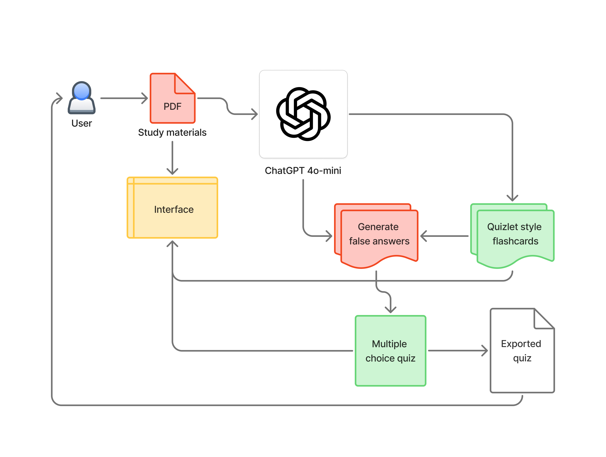

<a name="readme-top"></a>

[![Contributors][contributors-shield]][contributors-url]
[![Forks][forks-shield]][forks-url]
[![Stargazers][stars-shield]][stars-url]
[![Issues][issues-shield]][issues-url]
[![LinkedIn][linkedin-shield]][linkedin-url]
[![GitHub][github-shield]][github-url]


# ✅ [AI Textbook Quiz Creator](https://ai-textbook-quiz-creator.onrender.com/) 


<details>
  <summary>Table of Contents</summary>
  <ol>
    <li>
      <a href="#about-this-project">About this project</a>
      <ul>
        <li><a href="#key-features">Key features</a></li>
        <li><a href="#built-with">Built with</a></li>
      </ul>
    </li>
    <li>
      <a href="#getting-started">Getting started</a>
      <ul>
        <li><a href="#prerequisites">Prerequisites</a></li>
        <li><a href="#setup">Setup</a></li>
      </ul>
    </li>
    <li><a href="#usage">Usage</a></li>
    <li><a href="#demo">Demo</a></li>
    <li><a href="#contributing">Contributing</a></li>
    <li><a href="#contact-us">Contact us</a></li>
  </ol>
</details>

## ❓ About this project

<div align="center"> Got too much textbook cramming to do before finals? </div> <br/>

This application can help simplify your studying process by skimming the book's important details for you.
Upload your text document, and get access to AI-generated study tools, including flashcards and quizzes.

Studying shouldn't be tedious and overwhelming. With a fun and rewarding learning experience, you'll conquer your exams
with less stress and better quality time!

### Key features

1. **Create flashcards:**
   Turn your document into convenient and easy-to-use AI-generated flashcards, helping you to get to the core details for your studying.
2. **Take quizzes:**
   Once you're done going through your flashcards, test your knowledge by taking an AI-generated quiz based on the same material.
3. **Export your quiz:**
   If you want to save your quiz for later or share it with someone else, you can export the generated quiz to a PDF document.

<p align="right"><a href="#readme-top">Back to top</a></p>

### Built with

[![React][React]][React-url]
[![Flask][Flask]][Flask-url]
[![JavaScript][JavaScript]][JavaScript-url]
[![Python][Python]][Python-url]
[![ChatGPT][ChatGPT]][ChatGPT-url]
[![NPM][NPM]][NPM-url]
[![Render][Render]][Render-url]

<p align="right"><a href="#readme-top">Back to top</a></p>

## 💻 Getting started

To run this project locally, follow these steps.

### Prerequisites

You'll need an installation of Python with PIP and your preferred method of cloning Git projects.
   ```sh
   python --version
   pip --version
   git clone https://github.com/luna-miguel/textbook-quiz-creator.git
   ```

### Setup

#### Installing the backend
1. In the API folder, create a virtual environment `venv` and activate it.
```sh
   cd api
   python3 -m venv venv
   source venv/bin/activate
   ```

2. Install the Python package requirements from `requirements.txt`.
```sh
   pip install -r requirements.txt
   ```
  
3. Create `.flaskenv` file and set `FLASK_APP`, `FLASK_ENV`, `FLASK_RUN_HOST`, and `FLASK_RUN_PORT`.
4. Create `.env` file and set `OPENAI_API_KEY`.

#### Running the frontend
1. Activate the Flask backend.
```sh
   npm run start-api
   ```
2. Activate the React frontend.
```sh
   npm start
   ```
3. Open the website in your browser at the specified React host and port.
 ```sh
   http://localhost:3000/
   ```

<p align="right"><a href="#readme-top">Back to top</a></p>

## 📝 Usage

<br/>
<div align="center">
  
</div>

1. **Upload your text document to the file acceptor.**
    * Accepts .pdf, .docx, and .txt documents
    * Recommended files are max ~1MB of text
  
2. **The website will automatically generate and open the flashcards once your file has been uploaded.**
    * Use the left and right arrows or pagination dots to navigate the flashcards.
    * Click and hold on the flashcard to view the definition of the concept.
  
3. **To take the quiz, navigate to the last flashcard and click the button to generate. The quiz will open once finished loading.**
    * To answer each question, click on the radio button or associated answer choice, then click the "Check" button.
    * Once you have answered the question, click the "Next" button to go to the next question.

4. **After answering every question, you will see your score.**
    * You can export the quiz by clicking the "Export Quiz" button. It will automatically download a PDF file of the quiz questions and answer key.
    * You can start over from question 1 by clicking the "Retry" button.
    * You can generate another quiz and play it by clicking the "Generate another quiz" button.
    * You can go back to your flashcards by clicking the "Back to flashcards" button.


<p align="right"><a href="#readme-top">Back to top</a></p>

## 🎥 Demo

See the video below to watch a walkthrough of this application.

https://github.com/user-attachments/assets/a7333727-a50e-4111-bd0d-2a144b4a6431

<p align="right"><a href="#readme-top">Back to top</a></p>

## 💭 Contributing

**Any ideas to improve the project and help make studying more fun?** 

Fork the repo and create a pull request. You can also open an issue with the "enhancement" tag. <br/>
Please leave a star if you found this project useful. Thanks for checking it out! 

1. Fork the project
2. Create your branch (`git checkout -b <your-branch>`)
3. Commit your changes (`git commit -m 'Add cool feature'`)
4. Push to the branch (`git push origin <your-branch>`)
5. Open a pull request

<p align="right"><a href="#readme-top">Back to top</a></p>

## 📨 Contact us

If you have any questions or comments to share regarding this project, contact one of our members below:
* [Fedy Cherif](https://www.linkedin.com/in/fedycherif/) </br>
* [Mohammed Zian Hassan](https://www.linkedin.com/in/mohammed-zian-hassan/) </br>
* [Ynalois Pangilinan](https://www.linkedin.com/in/ynalois-pangilinan/) </br>
* [Alif Rahman](https://www.linkedin.com/in/alifrahmannyc/) </br>
* [Miguel Luna](https://www.linkedin.com/in/miguel-lorenzo-luna/) </br>
* [Tedd Lee](https://www.linkedin.com/in/teddlee/) </br>

<p align="right"><a href="#readme-top">Back to top</a></p>

[contributors-shield]: https://img.shields.io/github/contributors/luna-miguel/textbook-quiz-creator.svg?style=for-the-badge
[contributors-url]: https://github.com/luna-miguel/textbook-quiz-creator/graphs/contributors

[forks-shield]: https://img.shields.io/github/forks/luna-miguel/textbook-quiz-creator.svg?style=for-the-badge
[forks-url]: https://github.com/luna-miguel/textbook-quiz-creator/forks

[stars-shield]: https://img.shields.io/github/stars/luna-miguel/textbook-quiz-creator.svg?style=for-the-badge
[stars-url]: [https://github.com/GeorgiosIoannouCoder/realesrgan/stargazers](https://github.com/luna-miguel/textbook-quiz-creator/stargazers)

[issues-shield]: https://img.shields.io/github/issues/luna-miguel/textbook-quiz-creator.svg?style=for-the-badge
[issues-url]: [https://github.com/GeorgiosIoannouCoder/realesrgan/issues](https://github.com/luna-miguel/textbook-quiz-creator/issues)

[license-shield]: https://img.shields.io/github/license/luna-miguel/textbook-quiz-creator.svg?style=for-the-badge
[license-url]: https://github.com/GeorgiosIoannouCoder/realesrgan/blob/main/LICENSE

[linkedin-shield]: https://img.shields.io/badge/-LinkedIn-black.svg?style=for-the-badge&logo=linkedin&colorB=0077B5
[linkedin-url]: https://www.linkedin.com/in/miguel-lorenzo-luna/

[github-shield]: https://img.shields.io/badge/-GitHub-black.svg?style=for-the-badge&logo=github&colorB=000
[github-url]: https://github.com/luna-miguel

[Python]: https://img.shields.io/badge/python-FFDE57?style=for-the-badge&logo=python&logoColor=4584B6
[Python-url]: https://www.python.org/

[JavaScript]: https://img.shields.io/badge/javascript-%23323330.svg?style=for-the-badge&logo=javascript&logoColor=%23F7DF1E
[JavaScript-url]: https://developer.mozilla.org/en-US/docs/Web/JavaScript

[React]: https://img.shields.io/badge/react-%2320232a.svg?style=for-the-badge&logo=react&logoColor=%2361DAFB
[React-url]: https://react.dev/

[NPM]: https://img.shields.io/badge/NPM-%23CB3837.svg?style=for-the-badge&logo=npm&logoColor=white
[NPM-url]: https://www.npmjs.com/

[ChatGPT]: https://img.shields.io/badge/chatGPT-74aa9c?style=for-the-badge&logo=openai&logoColor=white
[ChatGPT-url]: https://chatgpt.com/

[Render]: https://img.shields.io/badge/Render-%46E3B7.svg?style=for-the-badge&logo=render&logoColor=white
[Render-url]: https://render.com/

[Flask]: https://img.shields.io/badge/flask-%23000.svg?style=for-the-badge&logo=flask&logoColor=white
[Flask-url]: https://flask.palletsprojects.com/en/stable/


